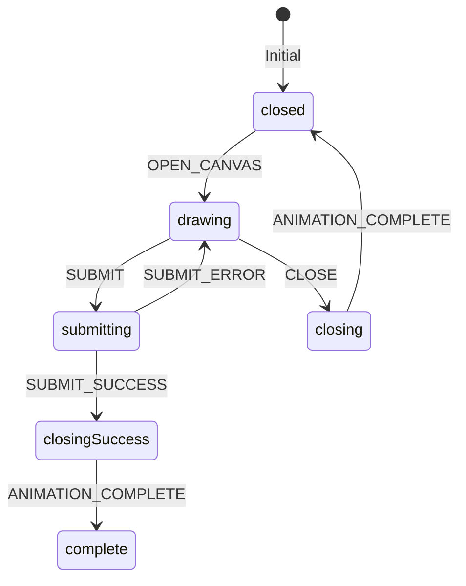

# Guestbook Drawing State Reducer Plan

## Overview

Convert the current drawingStatus state management to use a reducer pattern and add closing animations for all states.

## State Machine



## State Transition Types

```typescript
type DrawingState = { 
  state: 'closed' | 'drawing' | 'submitting' | 'closing' | 'closingSuccess' | 'complete'; 
  error: boolean;
};

type DrawingAction = 'OPEN_CANVAS' | 'SUBMIT' | 'SUBMIT_SUCCESS' | 'SUBMIT_ERROR' | 'CLOSE' | 'CLOSE_SUCCESS' | 'ANIMATION_COMPLETE';
```

## Implementation Steps

1. Create reducer function to manage state transitions:
   - Handle all state transitions based on current state and action
   - Separate closing states for success vs manual/error closes
   - Validate state changes with TypeScript

2. Add CSS transitions for closing states:
   - Use consistent animation duration (700ms)
   - Match existing fade-out animation style
   - closingSuccess: Animate out canvas + show preview in grid
   - closing: Simple fade out animation

3. Update component:
   - Replace multiple useState calls with useReducer
   - Add animation handlers for closing transitions
   - Update conditional rendering based on new state
   - Convert event handlers to dispatch actions

4. Testing scenarios:
   - Success path: drawing -> submit -> success -> closingSuccess -> complete
   - Error path: drawing -> submit -> error -> closing -> closed
   - Manual close: drawing -> closing -> closed
   - Verify all animations play smoothly
