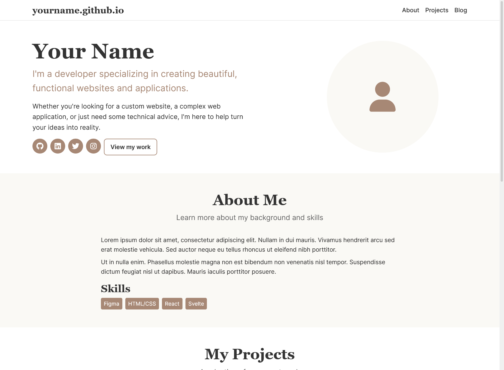

# Introduction

This guide is a written and extended version of the workshop I wrote for [WebLabs](https://weblabs.club/), a student organization run by some of my friends at the University of Wisconsin-Madison.

Have you ever wanted your own website, but been put off by the limited customization options (and monthly prices) of Carrd, Wix, or Squarespace? Or maybe you've tried to set up a blog using WordPress, but found it too complicated? It's one thing to learn basic HTML/CSS, but another thing entirely to actually deploy your work somewhere where people can see it. This workshop will help you build your own portfolio (and blog) using Astro, GitHub, and Markdown, assuming that you've only worked with bare HTML/CSS and a bit of JS so far. You won't need anything besides a GitHub account and a browser to get started.

This guide is meant to be a starting point for you to build your own portfolio website and host it for free. By "your own portfolio," I mean a site that you can customize and make your own. You can add your own images, change the layout and colors, and add any pages you like. The goal is to give you the tools and knowledge to create a website that reflects your personal style and interests.

# Why Even Bother?

Whether you're trying to land your first internship, link out from your socials, or just improve your skills, having a personal website that you own is incredibly valuable when everyone else is on centralized social platforms. Things like Carrd are fine, but they're limited and cost money if you want to customize them.
Beyond practical considerations, you learn a lot more by shipping stuff, rather than just reading about it or using it for homework. This guide will take you through a handful of free programs and websites that are used every day by developers in the real world, and will be invaluable for your growth as a developer. You can throw it on LinkedIn, your resume, your email signature, your cat's collar...

# What You'll Need

- A GitHub account
- A browser
- ~1 hour (less if you type fast)

# Outline

1. First, we'll develop the basic website design with CodePen.
2. Next, we'll set up the GitHub repository to host our portfolio.
3. Then, we'll port the CodePen code to Astro and add images.
4. After that, we'll deploy the site to GitHub Pages, which is free and easy to use.
5. Then we'll drop into GitHub Codespaces to add a blog to our portfolio using Astro's content collections.
6. Finally, I'll suggest some ways to improve your portfolio and blog, and give you some resources to learn more about Astro and web development in general.

# Step 1: Mess Around on CodePen



> [go.weblabs.club/portfolio-js](https://go.weblabs.club/portfolio-js)

Get a feel for how your portfolio might look:

- Don't worry about images yet.
- In the HTML panel, fill in your name, bio, links, skills, projects.
- Use the CSS variables to change colors and fonts, if you like.
- Once you're happy with it, we'll move onto the next step.

# Step 2: Clone the GitHub Template

> [go.weblabs.club/portfolio-github](https://go.weblabs.club/portfolio-github)

This template repository is essentially what you get by running `npm create astro@latest` and selecting the basic template, but I ripped out the parts that are unnecessary for this workshop. It doesn't include anything besides the bare minimum configuration, we'll be adding everything else as we go.

1. Sign in to GitHub.
2. Use the template to make a repo named `${your-username}.github.io`.

This is where your site will live. Beyond storing code, GitHub offers several other useful services like GitHub Pages, GitHub Actions, and GitHub Codespaces. In this case, GitHub Pages will host your site at that URL later.

---

# Step 3: CodePen, meet Astro

Astro is static site builder with _zero_ JS by default, unless you opt in. It's perfect for beginners that want a little extra sauce out of their HTML. You'll get components (like React) but no runtime overhead, and you can do cool things like Markdown-based blogs without needing a CMS.

## Porting to Astro

Your HTML/CSS from CodePen drops in _almost_ unchanged.

1. Open `src/pages/index.astro` on GitHub and select the pencil (edit) button.
2. Paste your CodePen HTML between the `<Layout>` tags.
3. Paste your CSS in a `<style is:global>` block after the HTML.

```astro
---
import Layout from "../layouts/Layout.astro";
---

<!-- Example -->
<Layout>
  <!-- Your HTML here -->
</Layout>

<style is:global>
  /* Your CSS here */
</style>
```

> [!question]- What's the deal with `is:global`?
> The `is:global` attribute [tells Astro that this CSS should be applied globally, rather than scoped to the component](https://docs.astro.build/en/reference/directives-reference/#isglobal). This is useful for styles that you want to apply to the entire page, like your main layout or global styles. In this case, you might later decide to break apart the page into components, and using `is:global` simplifies that process a bit since you don't have to disentangle which styles need to be copied over to the component.

Now for deployment:

- On GitHub, go to the **Actions** tab.
- Search for “Astro”, click to enable the action.
- Then go to **Settings > Pages** and choose the GitHub Action as your source.
- Wait a few seconds, then go to `https://your-username.github.io`.

It's live, and it's that simple.

> [!question]- Why do the icons still work?
> Okay, you got me. I cheated a bit, this template does include the same FontAwesome stylesheet that the CodePen template does. You can see it hiding in `src/layouts/Layout.astro` in the `<head>` section. `Layout.astro` is a component that wraps around your HTML, and it includes the `<head>` section for you. You can also add your own stylesheets or other scripts in there, if you want.

> [!question]- What is GitHub Actions?
> GitHub Actions is a way to automate tasks in your GitHub repository, like running tests, building your code, or deploying your site. It essentially lets you briefly borrow a completely clean computer to run your code, and then throw it away when you're done. In this case, we're using it to build our Astro site (which needs to run code to build) and deploy it to GitHub Pages. You can think of it as a way to run your code in the cloud, without needing to set up a server or anything like that.

> [!question]- How can GitHub pages be free?
> GitHub Pages only works for static files (so just HTML, CSS, JS and images). This means that you can't run any server-side code (like PHP or Node.js) on GitHub Pages, because GitHub doesn't run a server for you. Instead, your GitHub action will produce a handful of those HTML/CSS files, which GitHub stores up on a CDN, and your visitor's browsers do the work of rendering them. Serving static files is cheap enough that GitHub can afford to do it for free.
>
> Also, it's technically only free for public repositories, which means that anyone can see your code. GitHub does this partially because they want to encourage open-source development and collaboration, and partially because they're owned by Microsoft and can eat the cost.
>
> CloudFlare is another company that does free static hosting, and in their case they serve something like 20% of all websites through their CDN. In their case, the marginal cost of storing a couple megabytes of data on the CDN that other people are already paying for is negligible, so they can afford to give it away for free.

# Step 4: Add Images

Let's add some photos while we're here. You can do this from the GitHub web interface as well.

- Upload your image files to `/public`.
- Refer to them like:
  ```html
  
  ```
  No `public/` prefix, just the slash.

> [!question]- Why no `public/`?
> The `public` folder is a special folder in Astro, and most JS frontend frameworks. Anything in there isn't processed, and instead placed at the root of your final site, so `/public/myimage.png` will become just `/myimage.png` after building. This is different from other frameworks like React, where you have to use `public/` in the path.

---

# Step 5: Add Blog with Content Collections

This part would have been a live demo in the in-person workshop, so it's a little more informal, and there unfortunately are no template repos for you to copy. Now that we've got a wonderful portfolio site with all our projects and images, let's add a blog to it. This is a great way to show off your skills and share resources (like this workshop) with the world.

Astro's content collections allow you to create a blog with Markdown files. You can write your posts in (effectively) plain text, and Astro will take care of the rest. We'll also be using something called "frontmatter" to add metadata to your posts, like the title, date, and image.

> [!QUESTION]- What is Markdown?
> Markdown is a lightweight markup language that allows you to write formatted text in plain text files. Markdown files are typically saved with a `.md` extension and can be easily converted to HTML. As a result, they're widely used for writing content on the web. Some places you might've seen Markdown are GitHub READMEs, Discord, Reddit, Notion, or Obsidian. It's a great way to write content without spending lots of time fussing with HTML tags.
>
> Astro's markdown support uses specifically [GitHub-flavored Markdown](https://github.github.com/gfm/), which is a superset of the original Markdown spec.
>
> This blog post is written in Markdown, and you can see how it looks in the [source code](https://github.com/TetraTsunami/website/tree/main/posts/portfolio.mdx)! You'll notice the extension is `.mdx`, which is a special version of Markdown that allows you to use React components inside your Markdown files. This post doesn't use that feature, but Astro supports MDX too.

## 1. Open up GitHub Codespaces

We've been getting by on GitHub's web interface so far, but now we need to do some more complicated things. GitHub Codespaces is a way to run a full VSCode instance in your browser, and you get a certain number of hours for free. It's plenty for this use-case, but you can also use VSCode locally if you prefer.

You can open a GitHub Codespace by clicking the "Code" tab at the top of your repo, then clicking the green "Code" button above your files, then the "Codespaces" tab within the popup that appears. Finally, select "Create Codespace on main". This will create a new Codespace for you, which is a full VSCode instance running in your browser. It'll also download your repo dependencies, so all you need to do is wait a minute or so for it to load, then type `npm run dev` in the terminal to see a live preview of your site.

## 2. Define Your Blog Schema

Astro's content collections are a way to define the structure of your content. You can think of them sort of like creating a database for your blog posts. Each post will have a title, date, and other metadata that we'll use later to display your posts on the site.

Create `src/content/config.ts`:

```ts
import { defineCollection, z } from "astro:content";

const blogCollection = defineCollection({
  type: "content",
  schema: z.object({
    title: z.string(),
    date: z.date(),
    excerpt: z.string(),
    image: z.string().optional(),
  }),
});

export const collections = {
  blog: blogCollection,
};
```

## 3. Write Some Posts

Create at least one Markdown file in `src/content/blog/`.

`src/content/blog/first-post.md`:

```md
---
title: "First Blog Post"
date: 2025-04-16
excerpt: "A quick dive into making your first blog post in Astro."
---

Here's your actual blog content. Markdown works here!
```

> [!question]- What is frontmatter?
> You'll notice that the Markdown file starts with a block of text between `---` lines. This is called "frontmatter", and it's a way to add metadata to your Markdown files. The frontmatter is written in YAML, which is a human-readable data format. Think of it a bit like JSON. In this case, we're using it to define the title, date, and excerpt for our blog post. Astro will use this frontmatter to display the title, date, and excerpt elsewhere on the site. You can also use frontmatter to define other metadata, like tags, categories, and more.

## 4. Show Posts on the Main Site

Back in your `src/pages/index.astro`, import your blog collection at the top of the file (the frontmatter area that was YAML in Markdown files is JavaScript in Astro):

```astro
---
import { getCollection } from "astro:content";
const posts = await getCollection("blog");
const sortedPosts = posts.sort(
  (a, b) => b.data.date.getTime() - a.data.date.getTime(),
); // sorts by date, if you like
---
```

Then, replace the dummy blog section further down the file with this:

```astro
<section id="blog" class="blog">
  <div class="container">
    <h2>Blog</h2>
    <p>Thoughts, tutorials, and insights</p>
    <div class="blog-grid">
      {
        sortedPosts.map((post) => (
          <div class="blog-card">
            <div class="blog-date">
              {post.data.date.toLocaleDateString("en-US")}
            </div>
            <h3>{post.data.title}</h3>
            <p>{post.data.excerpt}</p>
            <a href={`/blog/${post.slug}`}>
              Read More <i class="fa-solid fa-arrow-right" />
            </a>
          </div>
        ))
      }
    </div>
  </div>
</section>
```

You'll notice that, like React, Astro uses `{}` to interpolate JavaScript into your HTML. This is a great way to dynamically generate content based on your data. In this case, we're using it to loop through the blog posts and display them in a grid. Note that _unlike_ React, this JavaScript will only run _once_ at build-time, so you shouldn't try to make it interactive.

You'll also notice that we're linking to `/blog/${post.slug}`. Let's go create that page now!

## 5. Create a Template for Individual Posts

Make `src/pages/blog/[...slug].astro`:

```astro
---
import { getCollection } from "astro:content";
import Layout from "../../layouts/Layout.astro";

// Generate paths for all blog posts
export async function getStaticPaths() {
  const blogEntries = await getCollection("blog");
  return blogEntries.map((entry) => ({
    params: { slug: entry.slug },
    props: { entry },
  }));
}

// Get the blog post content
const { entry } = Astro.props;
// Markdown is text, so we need to "render" it to transform it into HTML
const { Content } = await entry.render();
---

<Layout>
  <article class="blog-post container">
    <h1>{entry.data.title}</h1>
    <time datetime={entry.data.date.toISOString()}>
      {
        entry.data.date.toLocaleDateString("en-US", {
          year: "numeric",
          month: "long",
          day: "numeric",
        })
      }
    </time>
    <div class="blog-content">
      <Content />
    </div>
    <a href="/#blog">← Back to Blog</a>
  </article>
</Layout>
```

Now if you go to `/blog/first-post` (or whatever you named your markdown file), you should see your blog post!

> [!question]- What is `getStaticPaths`?
> Astro does all its work at build time (inside your GitHub Action), so it needs to know what pages to generate ahead of time. `getStaticPaths` is a way to tell Astro which pages to generate based on your data. In this case, we're using it to generate a page for each blog post in our collection. You can think of it as a way to "pre-render" your pages at build time, rather than waiting for the user to request them, since we aren't allowed to run any server-side code on GitHub Pages.

## 6. Commit Your Hard Work

Let's commit your changes in Codespaces, and push them to GitHub, so your Action can run and your site will be live! You can do that by selecting the "Source Control" tab (looks like a few nodes connected by lines, and probably has a notification icon on it) on the left sidebar, then clicking the "+" icon next to each file you changed. Then, type a commit message (like "Added blog") and click the "Commit" button to commit your changes. Finally, click the "Sync Changes" button at the top of the sidebar to push your changes to GitHub.

Wait a minute, then refresh your site. You should see your blog posts on the homepage, and if you click on one, it should take you to the individual post page!

# You're Done (But You Should Totally Keep Going)

This is a great start, but there's so much more you can do with Astro. Here are some ideas and links to get you started:

- The blog post page is... lightly themed, to say the least. You could totally spruce it up a bit.
- Maybe you don't want all your posts on the home page. You can add another page that just lists your blog posts!
- Tailwind is a common way to add some styling to sites in a more terse form than straight CSS. You can [add Tailwind to Astro](https://docs.astro.build/en/guides/integrations-guide/tailwind/) in just a few minutes, and it makes it super easy to add responsive styles and custom themes.
- If you want to add reactivity, you can add frontend frameworks like React and Svelte to Astro with just a few commands. Astro is designed to work with these frameworks, so you can use them to build interactive components without needing to set up a whole React or Svelte app. You can also use MDX to write your blog posts in Markdown and include React components inside them.
- You could set up [Giscus](https://giscus.app/) for a free commenting system on your blog posts. You can see an example of it on this very page! Giscus is a free, open-source commenting system that uses GitHub Discussions to store comments. It's a great way to add comments to your blog posts without needing to set up a whole backend or database. You can also use it to get feedback on your posts and engage with your readers.
- Having the `username.github.io` URL is a bit lame. You can [set up a custom domain](https://docs.github.com/en/pages/configuring-a-custom-domain-for-your-github-pages-site), but you'll have to pay for one. They're usually less than $15/year, though, so it's worth it if you want to continue doing things on the web. [tld-list.com](https://tld-list.com/) is a good way to search for domains that aren't already registered!
- If you use Discord, you might consider setting up my [Discord GitHub Preview project](https://github.com/TetraTsunami/discord-github-preview) :). It'll show your Discord activity in an SVG that you can place in an `` tag. This is a great way to show off your activity and make your site more dynamic.
- If you plan to post a lot on your blog, you might set up [an RSS feed](https://docs.astro.build/en/recipes/rss/) so people can subscribe to it. This is a great way to keep your readers updated on your latest posts, and it's a good way to learn about RSS feeds and XML. Astro also makes this dead simple.
